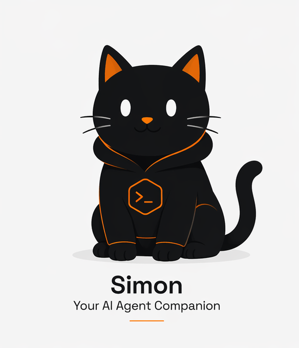

# SimonOS



## Executive Summary

AI is becoming more powerful every day—but also more opaque, less controllable, and increasingly detached from where real work happens.

SimonOS is built on a simple idea:

> **AI should run where you work, with full control, full visibility, and zero compromises on security.**

Instead of relying on black-box systems or fragile agent experiments, SimonOS provides a **local-first runtime** that lets you execute AI agents directly on your machine—safely, predictably, and with complete transparency.

- No hidden execution  
- No uncontrolled actions  
- No loss of data ownership  

Just **deterministic, observable, and extensible AI systems** you can actually trust.

If you believe the next step in AI is not more hype—but more control—  
you’re in the right place.

---

## Overview

SimonOS is a local-first runtime for personal agentic AI, implemented as a single Go binary.

---

## Current Scope

This scaffold provides:
- CLI commands for `run`, `chat`, and `config`
- A composable agent engine with events, tools, memory, routing, and guardrails
- Built-in file and shell tools with workspace-aware access control
- SQLite-backed persistent memory and an example OpenAI-compatible provider contract

---

## Quick Start

```bash
go mod tidy
go run ./cmd/simonos run --input "Summarize the workspace"
go run ./cmd/simonos chat
```

---

## Project Layout

The repository matches the structure in the SimonOS v1 specification:

* `cmd/simonos`: CLI entrypoint and commands
* `internal/agent`: runtime loop and task orchestration
* `internal/tools`: tool contracts, registry, executor, built-ins
* `internal/memory`: short-term and long-term memory backends
* `internal/model`: provider abstraction and router
* `internal/guardrails`: policy evaluation and enforcement
* `internal/events`: event model and in-process bus
* `internal/config`: YAML config loading
* `internal/workspace`: workspace boundary handling

---

## Notes

This is a v1-ready skeleton intended to stay replaceable and easy to extend. The OpenAI provider included here is a stub implementation that keeps the interface stable while the transport/auth details are finalized.

---

## License

This project is licensed under the MIT License. See [LICENSE](LICENSE).

